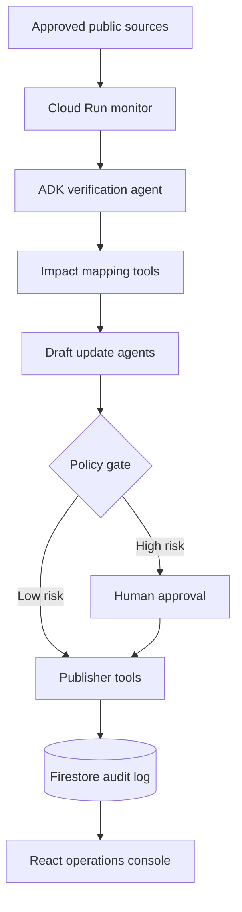

# Architecture

Gemini 3.5 Flash supplies source interpretation, evidence-grounded reasoning,
and bounded draft generation. Google ADK owns the agent and its allowlisted
tools. Cloud Run supplies the asynchronous API surface. The production design
stores workflow state, approval interrupts, source snapshots, and audit events
in Firestore.

The policy gate is deliberately deterministic. A model cannot self-approve a
high-risk action, widen its own tool permissions, or publish an artifact whose
evidence hash has changed since drafting.

